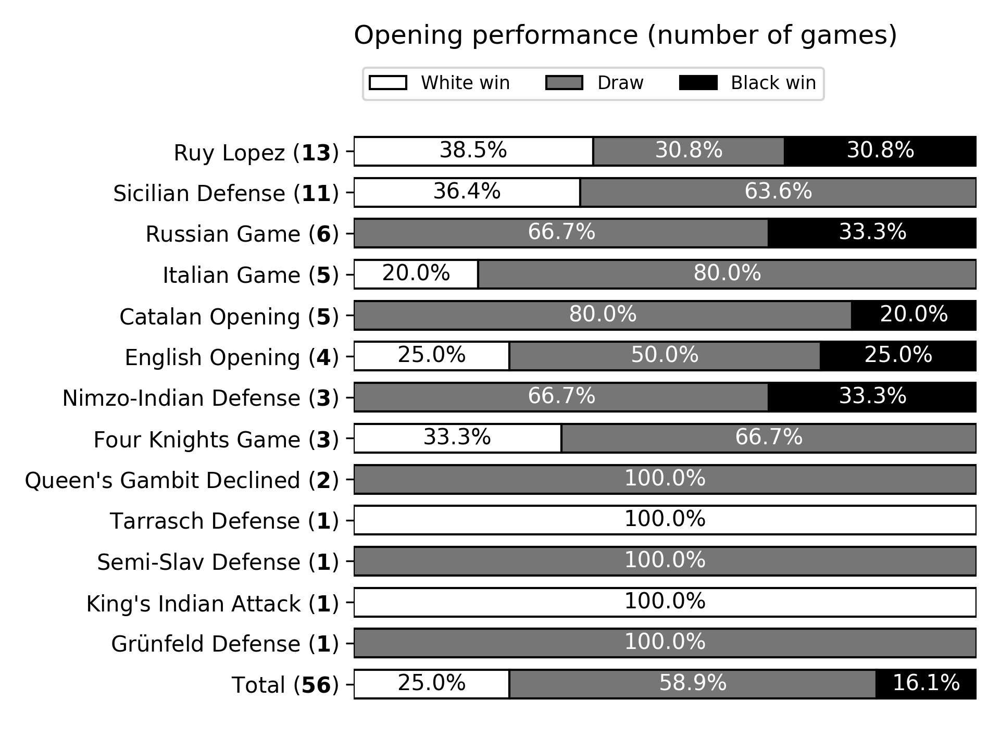

# Candidates 2022: Opening Analysis

Investigation into the most common openings used in the FIDE Candidates 2022, and how well they performed. Full write-up [here](https://emilio.co.za/candidates-2022).



## Motivation

The FIDE Candidates Tournament is well known to be the peak of opening preparation, second only to the FIDE World Championship itself. The participants do not hold anything back in terms of opening prep, as the biggest prize in all of chess is on the line: an opportunity to play for the title of World Champion.

## Description

Dataset of all games, in PGN form, were downloaded from [Lichess](lichess.org) and can be found in the `/data` directory.

Figures can be found in the `/figures` directory.

Source code lives in the `/src` directory.

All data parsing and plotting done using Python. `python-chess` used to parse PGN data, `pandas` used to clean and process data, and plots made using `matplotlib`.

For a full discussion of the results, see the [post](https://emilio.co.za/candidates-2022) on my website.

## Usage

This project was carried out using Python version `3.10.3`

Local usage is straightforward. Clone the repository, install dependencies in a virtual environment and run the `main.py` file from the project's root directory.

```bash
$ git clone https://github.com/emilioziniades/candidates-2022-openings/
$ cd candidates-2022-openings
$ python -m venv venv
$ source menv/bin/activate
$ pip install -r requirements.txt
$ python src/main.py
```

This will generate three charts in the `/figures` folder, overwriting the existing charts.
